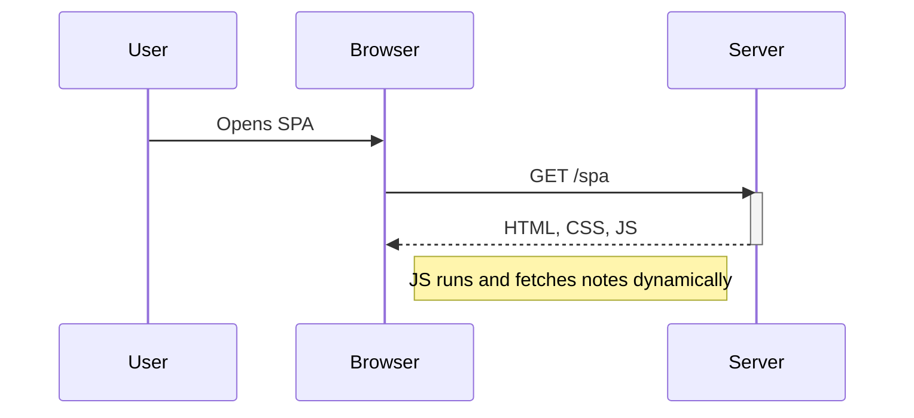

```mermaid
sequenceDiagram
    participant User
    participant Browser
    participant Server

    User->>Browser: Opens SPA
    Browser->>Server: GET /spa
    activate Server
    Server-->>Browser: HTML, CSS, JS
    deactivate Server

    Note right of Browser: JS runs and fetches notes dynamically
```
