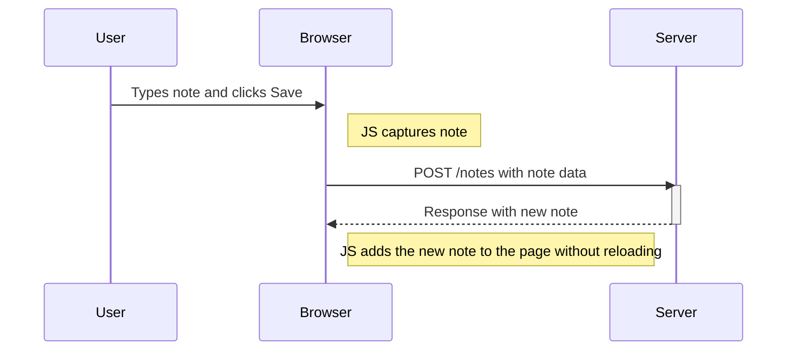

```mermaid
sequenceDiagram
    participant User
    participant Browser
    participant Server

    User->>Browser: Types note and clicks Save
    Note right of Browser: JS captures note

    Browser->>Server: POST /notes with note data
    activate Server
    Server-->>Browser: Response with new note
    deactivate Server

    Note right of Browser: JS adds the new note to the page without reloading

```
